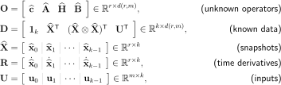

# Summary of Mathematical Details

This document gives a short explanation of the mathematical details behind the package.
For a full treatment, see [\[1\]](#references).
Note that some notation has been altered for coding convenience and clarity.

**Contents**
- [**Problem Statement**](#problem-statement)
- [**Projection-based Model Reduction**](#projection-based-model-reduction)
- [**Operator Inference via Least Squares**](#operator-inference-via-least-squares)
- [**Extensions and Variations**](#extensions-and-variations)
- [**Index of Notation**](#index-of-notation)
- [**References**](#references)

## Problem Statement

Consider the (possibly nonlinear) system of _n_ ordinary differential equations with state variable **x**, input (control) variable **u**, and independent variable _t_:

where

This system is called the _full-order model_ (FOM).
If _n_ is large, as it often is in high-consequence engineering applications, it is computationally expensive to numerically solve the FOM.
This package provides tools for constructing a _reduced-order model_ (ROM) that is up to quadratic in the state **x** with optional linear control inputs **u**.
The procedure is data-driven, non-intrusive, and relatively inexpensive.
In the most general case, the code can construct and solve a reduced-order system with the polynomial form

where now

This reduced low-dimensional system approximates the original high-dimensional system, but it is much easier (faster) to solve because of its low dimension _r_ << _n_.

## Projection-based Model Reduction

Model reduction via projection occurs in three steps:
1. **Data Collection**: Gather snapshot data, i.e., solutions to the full-order model (the FOM) at various times / parameters.
2. **Compression**: Compute a low-rank basis (which defines a low-dimensional linear subspace) that captures most of the behavior of the snapshots.
3. **Projection**: Use the low-rank basis to construct a low-dimensional ODE (the ROM) that approximates the FOM.

This package focuses mostly on step 3 and provides a few light tools for step 2.

Let **X** be the _n_ x _k_ matrix whose _k_ columns are each solutions to the FOM of length _n_ (step 1), and let **V**_r_ be an orthonormal _n_ x _r_ matrix representation for an _r_-dimensional subspace (step 2).
A common choice for **V**_r_ is the POD basis of rank _r_, the matrix whose columns are the first _r_ singular vectors of **X**.
We call **X** the _snapshot matrix_ and **V**_r_ the _basis matrix_.

The classical _intrusive_ approach to the projection step is to make the Ansatz

Inserting this into the FOM and multiplying both sides by the transpose of **V**_r_ (Galerkin projection) yields

This new system is _r_-dimensional in the sense that

If the FOM operator **f** is known and has a nice structure, this reduced system can be solved cheaply by precomputing any involved matrices and then applying a time-stepping scheme.
For example, if **f** is linear in **x** and there is no input **u**, then

However, this approach breaks down if the FOM operator **f** is unknown, uncertain, or highly nonlinear.

## Operator Inference via Least Squares

Instead of directly computing the reduced operators, the Operator Inference framework takes a data-driven approach: assuming a specific structure of the ROM (linear, quadratic, etc.), solve for the involved operators that best fit the data.
For example, suppose that we seek a ROM of the form

We start with _k_ snapshots **x**_j_ and inputs **u**_j_.
That is, **x**_j_ is an approximate solution to the FOM at time _t_j with input **u**_j_ = **u**(_t__j_).
We compute the basis matrix **V**_r_  from the snapshots (e.g., by taking the SVD of the matrix whose columns are the **x**_j_) and project the snapshots onto the _r_-dimensional subspace defined by the basis via

We also require time derivative information for the snapshots.
These may be provided by the FOM solver or estimated, for example with finite differences of the projected snapshots.
With projected snapshots, inputs, and time derivative information in hand, we then solve the least-squares problem

Note that this minimum-residual problem is not (yet) in a typical linear least-squares form, as the unknown quantities are the _matrices_, not the vectors.
Recalling that the vector _2_-norm is related to the matrix Frobenius norm, i.e.,

we can rewrite the residual objective function in the more typical matrix form:

where

and where **1**_k_ is a _k_-vector of 1's and _d(r,m) = 1 + r + r2 + m_.
For our purposes, the ⊗ operator between matrices denotes a column-wise Kronecker product, sometimes called the [Khatri-Rao product](https://en.wikipedia.org/wiki/Kronecker_product#Khatri%E2%80%93Rao_product).

The minimization problem given above decouples into _r_ independent ordinary least-squares problems, one for each of the columns of **O**T.
Though each independent sub-problem is typically well-posed, the problem is susceptible to noise (from model misspecification, the truncation of the basis, numerical estimation of time derivatives, etc.) and can therefore suffer from overfitting.
To combat this, the problems can be regularized with a Tikhonov penalization.
In this case, the complete minimization problem is given by

It can be shown [\[1\]](#references) that, under some idealized assumptions, the operators inferred by solving this data-driven minimization problem converge to the operators computed by explicit projection.
The key idea, however, is that _the inferred operators can be cheaply computed without knowing the full-order model_.
This is very convenient in "glass box" situations where the FOM is given by a legacy code for complex simulations but the target dynamics are known.

### Implementation Note: The Kronecker Product

The [Kronecker product](https://en.wikipedia.org/wiki/Kronecker_product) ⊗ introduces some redundancies.
For example, **x** ⊗ **x** contains both _x_1_x_2 and _x_2_x_1.
To avoid these redundancies, we introduce a "compact" Kronecker product which only computes the unique terms of the usual Kronecker product:

The dimension _r(r+1)/2_ arises because we choose _2_ of _r_ entries _without replacement_, i.e., this is a _multiset_ coefficient:

When the compact Kronecker product is used, we call the resulting inferred quadratic operator **H**c instead of **H**.
We similarly define a cubic compact product recursively with the quadratic compact product and call the resulting cubic inferred operator **G**c instead of **G**.

## Extensions and Variations

### The Discrete Setting

The framework described above can also be used to construct reduced-order models for approximating _discrete_ dynamical systems, as may arise from discretizing PDEs in both space and time.
For instance, we can learn a discrete ROM of the form

The procedure is the same as described in the previous section with the exception that the snapshot matrix **X** has columns **x**_j_ for _j = 0,1,...,k-1_, while the right-hand side matrix **R** has columns **x**_j_ for _j = 1,...,k_.
That is, the (not yet regularized) least-squares problem to be solved has the form

<!-- TODO: ### The Steady Setting -->

<!-- TODO: ### Lifting and Variable Transformations -->

<!-- TODO: ### Re-projection and Recovering Intrusive Models -->

<!-- TODO: ### Incorporating Nonlinear Terms with DEIM -->

<!-- TODO: ### Learning Parametric Models  -->

## Index of Notation

We generally denote scalars in lower case, vectors in bold lower case, matrices in upper case, and indicate low-dimensional quantities with a hat.
In the code, a low-dimensional quantity ends with an underscore, so that the model classes follow some principles from the [scikit-learn](https://scikit-learn.org/stable/index.html) [API](https://scikit-learn.org/stable/developers/contributing.html#apis-of-scikit-learn-objects).

### Dimensions

| Symbol | Code | Description |
| :----: | :--- | :---------- |
|  | `n`  | Dimension of the full-order system (large) |
|  | `r`  | Dimension of the reduced-order system (small) |
|  | `m`  | Dimension of the input **u** |
|  | `k`  | Number of state snapshots, i.e., the number of training points |
|  | `s`  | Number of parameter samples for parametric training |
|  | `p` | Dimension of the parameter space |
|  | `d` | Number of columns of the data matrix _D_ |

<!-- |  | `l` | Dimension of the output **y** | -->

<!-- ### Scalars

| Symbol | Code | Description |
| :----: | :--- | :---------- |
|  | `nt`  | Number of time steps in a simulation |
| | `µ` | Scalar parameter (_p_ = 1). | -->

### Vectors

| Symbol | Code | Size | Description |
| :----: | :--- | :--: | :---------- |
|  | `x` |  | Full-order state vector |
|  | `x_` |  | Reduced-order state vector |
|  | `xdot_` |  | Reduced-order state time derivative vector |
|  | `x_ROM` |  | Approximation to **x** produced by ROM |
|  | `c_` |  | Learned constant term  |
|  | `u` |  | Input vector  |
|  | `f(t,x,u(t))` or `f(x,u)` |   | Full-order system operator |
|  | `f_(t,x_,u(t))` or `f(x_,u)` |   | Reduced-order system operator |
|  | `np.kron(x,x)` |  | Quadratic Kronecker product of full state |
|  | `np.kron(x_,x_)` |   | Quadratic Kronecker product of reduced state |
|  | `utils.kron2c(x_)` |   | Compact quadratic Kronecker product of reduced state |
|  | `np.kron(x,np.kron(x,x))` |  | Cubic Kronecker product of full state |
|  | `np.kron(x_,np.kron(x_,x_))` |   | Cubic Kronecker product of reduced state |
|  | `utils.kron3c(x_)` |   | Compact cubic Kronecker product of reduced state |
|  | `vj` |  | _j_th subspace basis vector, i.e., column _j_ of **V**_r_ |

<!-- | **y**  | `y`             | Output vector | -->
<!-- | **y_ROM**, **y~** | `y_ROM`      | Approximation to **y** produced by ROM | -->

### Matrices

| Symbol | Code | Shape | Description |
| :----: | :--- | :---: | :---------- |
|  | `Vr` |  | low-rank basis of rank _r_ (usually the POD basis) |
|  | `X` |  | Snapshot matrix |
|  | `Xdot` |  | Snapshot time derivative matrix |
|  | `U` |  | Input matrix (inputs corresonding to the snapshots) |
|  | `X_` |  | Projected snapshot matrix |
|  | `Xdot_` |  | Projected snapshot time derivative matrix |
|  | `D` |  | Data matrix |
|  | `O` |  | Operator matrix |
|  | `R` |  | Right-hand side matrix |
|  | `P` |  | Tikhonov regularization matrix |
|  | `A` |  | Full-order linear state matrix |
|  | `A_` |  | Reduced-order linear state matrix |
|  | `H` |  | Full-order matricized quadratic state tensor |
|  | `H_` |  | Reduced-order matricized quadratic state tensor |
|  | `Hc_` |  | Compact reduced-order matricized quadratic state tensor |
|  | `G` |  | Full-order matricized quadratic state tensor |
|  | `G_` |  | Reduced-order matricized quadratic state tensor |
|  | `Gc_` |  | Compact reduced-order matricized quadratic state tensor |
|  | `B` |  | Full-order input matrix |
|  | `B_` |  | Reduced-order input matrix |

<!-- |  | `C` |  | Full-order output matrix | -->
<!-- |  | `C_` |  | Reduced-order output matrix | -->
<!-- |  | `Ni_` |  | Bilinear state-input matrix for _i_th input | -->

## References

- \[1\] [Peherstorfer, B.](https://scholar.google.com/citations?user=C81WhlkAAAAJ) and [Willcox, K.](https://kiwi.oden.utexas.edu/),
[Data-driven operator inference for non-intrusive projection-based model reduction.](https://www.sciencedirect.com/science/article/pii/S0045782516301104)
_Computer Methods in Applied Mechanics and Engineering_, Vol. 306, pp. 196-215, 2016.
([Download](https://kiwi.oden.utexas.edu/papers/Non-intrusive-model-reduction-Peherstorfer-Willcox.pdf))

BibTeX
<pre>
@article{PW2016OperatorInference,
    title     = {Data-driven operator inference for nonintrusive projection-based model reduction},
    author    = {Peherstorfer, B. and Willcox, K.},
    journal   = {Computer Methods in Applied Mechanics and Engineering},
    volume    = {306},
    pages     = {196--215},
    year      = {2016},
    publisher = {Elsevier}
}</pre>

- \[2\] [Qian, E.](https://scholar.google.com/citations?user=jnHI7wQAAAAJ), [Kramer, B.](http://kramer.ucsd.edu/), [Marques, A.](https://scholar.google.com/citations?user=d4tBWWwAAAAJ), and [Willcox, K.](https://kiwi.oden.utexas.edu/),
[Transform & Learn: A data-driven approach to nonlinear model reduction](https://arc.aiaa.org/doi/10.2514/6.2019-3707).
In the AIAA Aviation 2019 Forum & Exhibition, Dallas, TX, June 2019. ([Download](https://kiwi.oden.utexas.edu/papers/learn-data-driven-nonlinear-reduced-model-Qian-Willcox.pdf))

BibTeX
<pre>
@inbook{QKMW2019TransformAndLearn,
    title     = {Transform \\& Learn: A data-driven approach to nonlinear model reduction},
    author    = {Qian, E. and Kramer, B. and Marques, A. N. and Willcox, K. E.},
    booktitle = {AIAA Aviation 2019 Forum},
    doi       = {10.2514/6.2019-3707},
    URL       = {https://arc.aiaa.org/doi/abs/10.2514/6.2019-3707},
    eprint    = {https://arc.aiaa.org/doi/pdf/10.2514/6.2019-3707}
}</pre>

- \[3\] [Swischuk, R.](https://scholar.google.com/citations?user=L9D0LBsAAAAJ), [Mainini, L.](https://scholar.google.com/citations?user=1mo8GgkAAAAJ), [Peherstorfer, B.](https://scholar.google.com/citations?user=C81WhlkAAAAJ), and [Willcox, K.](https://kiwi.oden.utexas.edu/),
[Projection-based model reduction: Formulations for physics-based machine learning.](https://www.sciencedirect.com/science/article/pii/S0045793018304250)
_Computers & Fluids_, Vol. 179, pp. 704-717, 2019.
([Download](https://kiwi.oden.utexas.edu/papers/Physics-based-machine-learning-swischuk-willcox.pdf))

BibTeX
<pre>
@article{SMPW2019PhysicsbasedML,
    title     = {Projection-based model reduction: Formulations for physics-based machine learning},
    author    = {Swischuk, R. and Mainini, L. and Peherstorfer, B. and Willcox, K.},
    journal   = {Computers \\& Fluids},
    volume    = {179},
    pages     = {704--717},
    year      = {2019},
    publisher = {Elsevier}
}</pre>

- \[4\] [Swischuk, R.](https://scholar.google.com/citations?user=L9D0LBsAAAAJ), [Physics-based machine learning and data-driven reduced-order modeling](https://dspace.mit.edu/handle/1721.1/122682). Master's thesis, Massachusetts Institute of Technology, 2019. ([Download](https://dspace.mit.edu/bitstream/handle/1721.1/122682/1123218324-MIT.pdf))

BibTeX
<pre>
@phdthesis{swischuk2019MLandDDROM,
    title  = {Physics-based machine learning and data-driven reduced-order modeling},
    author = {Swischuk, Renee},
    year   = {2019},
    school = {Massachusetts Institute of Technology}
}</pre>

- \[5\] [Peherstorfer, B.](https://scholar.google.com/citations?user=C81WhlkAAAAJ) [Sampling low-dimensional Markovian dynamics for pre-asymptotically recovering reduced models from data with operator inference](https://arxiv.org/abs/1908.11233). arXiv:1908.11233.
([Download](https://arxiv.org/pdf/1908.11233.pdf))

BibTeX
<pre>
@article{peherstorfer2019samplingMarkovian,
    title   = {Sampling low-dimensional Markovian dynamics for pre-asymptotically recovering reduced models from data with operator inference},
    author  = {Peherstorfer, Benjamin},
    journal = {arXiv preprint arXiv:1908.11233},
    year    = {2019}
}</pre>

- \[6\] [Swischuk, R.](https://scholar.google.com/citations?user=L9D0LBsAAAAJ), [Kramer, B.](http://kramer.ucsd.edu/), [Huang, C.](https://scholar.google.com/citations?user=lUXijaQAAAAJ), and [Willcox, K.](https://kiwi.oden.utexas.edu/), [Learning physics-based reduced-order models for a single-injector combustion process](https://arc.aiaa.org/doi/10.2514/1.J058943). _AIAA Journal_, Vol. 58:6, pp. 2658-2672, 2020. Also in Proceedings of 2020 AIAA SciTech Forum & Exhibition, Orlando FL, January, 2020. Also Oden Institute Report 19-13.
([Download](https://kiwi.oden.utexas.edu/papers/learning-reduced-model-combustion-Swischuk-Kramer-Huang-Willcox.pdf))

BibTeX
<pre>
@article{SKHW2020ROMCombustion,
    title     = {Learning physics-based reduced-order models for a single-injector combustion process},
    author    = {Swischuk, R. and Kramer, B. and Huang, C. and Willcox, K.},
    journal   = {AIAA Journal},
    volume    = {58},
    number    = {6},
    pages     = {2658--2672},
    year      = {2020},
    publisher = {American Institute of Aeronautics and Astronautics}
}</pre>

- \[7\] [Qian, E.](https://scholar.google.com/citations?user=jnHI7wQAAAAJ), [Kramer, B.](http://kramer.ucsd.edu/), [Peherstorfer, B.](https://scholar.google.com/citations?user=C81WhlkAAAAJ), and [Willcox, K.](https://kiwi.oden.utexas.edu/) [Lift & Learn: Physics-informed machine learning for large-scale nonlinear dynamical systems](https://www.sciencedirect.com/science/article/abs/pii/S0167278919307651). _Physica D: Nonlinear Phenomena_, Vol. 406, May 2020, 132401. ([Download](https://kiwi.oden.utexas.edu/papers/lift-learn-scientific-machine-learning-Qian-Willcox.pdf))

BibTeX
<pre>
@article{QKPW2020LiftAndLearn,
    title   = {Lift \\& Learn: Physics-informed machine learning for large-scale nonlinear dynamical systems.},
    author  = {Qian, E. and Kramer, B. and Peherstorfer, B. and Willcox, K.},
    journal = {Physica {D}: {N}onlinear {P}henomena},
    volume  = {406},
    pages   = {132401},
    url     = {https://doi.org/10.1016/j.physd.2020.132401},
    year    = {2020}
}</pre>

- \[8\] [Benner, P.](https://scholar.google.com/citations?user=6zcRrC4AAAAJ), [Goyal, P.](https://scholar.google.com/citations?user=9rEfaRwAAAAJ), [Kramer, B.](http://kramer.ucsd.edu/), [Peherstorfer, B.](https://scholar.google.com/citations?user=C81WhlkAAAAJ), and [Willcox, K.](https://kiwi.oden.utexas.edu/) [Operator inference for non-intrusive model reduction of systems with non-polynomial nonlinear terms](https://arxiv.org/abs/2002.09726). arXiv:2002.09726. Also Oden Institute Report 20-04. ([Download](https://kiwi.oden.utexas.edu/papers/Non-intrusive-nonlinear-model-reduction-Benner-Goyal-Kramer-Peherstorfer-Willcox.pdf))

BibTeX
<pre>
@article{BGKPW2020OpInfNonPoly,
    title   = {Operator inference for non-intrusive model reduction of systems with non-polynomial nonlinear terms},
    author  = {Benner, P. and Goyal, P. and Kramer, B. and Peherstorfer, B. and Willcox, K.},
    journal = {arXiv preprint arXiv:2002.09726},
    year    = {2020}
}</pre>

