# Summary of Mathematical Details

This document gives a short explanation of the mathematical details behind the package.
For a full treatment, see [\[1\]](https://www.sciencedirect.com/science/article/pii/S0045782516301104).
However, note that some notation has been altered for coding convenience and clarity.

**Contents**
- [**Problem Statement**](#problem-statement)
- [**Projection-based Model Reduction**](#projection-based-model-reduction)
- [**Operator Inference via Least Squares**](#operator-inference-via-least-squares)
- [**Index of Notation**](#index-of-notation)
- [**References**](#references)

## Problem Statement

Consider the (possibly nonlinear) system of _n_ ordinary differential equations with state variable **x**, input (control) variable **u**, and independent variable _t_:

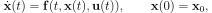

where

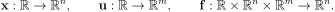

This system is called the _full-order model_ (FOM).
If _n_ is large, as it often is in high-consequence engineering applications, it is computationally expensive to numerically solve the FOM.
This package provides tools for constructing a _reduced-order model_ (ROM) that is up to quadratic in the state **x** with optional linear control inputs **u**.
The procedure is data-driven, non-intrusive, and relatively inexpensive.
In the most general case, the code can construct and solve a reduced-order system with the polynomial form

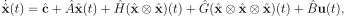

<!-- 

  

 -->

where now

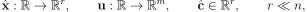

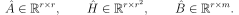

<!-- 

  

 -->

This reduced low-dimensional system approximates the original high-dimensional system, but it is much easier (faster) to solve because of its low dimension _r_ << _n_.

## Projection-based Model Reduction

Model reduction via projection occurs in three steps:
1. **Data Collection**: Gather snapshot data, i.e., solutions to the full-order model (the FOM) at various times / parameters.
2. **Compression**: Compute a low-rank basis (which defines a low-dimensional linear subspace) that captures most of the behavior of the snapshots.
3. **Projection**: Use the low-rank basis to construct a low-dimensional ODE (the ROM) that approximates the FOM.

<!-- These steps comprise what is called the _offline phase_ in the literature, since they can all be done before the resulting ROM is simulated. -->

This package focuses on step 3, constructing the ROM given the snapshot data and the low-rank basis from steps 1 and 2, respectively.

Let _X_ be the _n_ x _k_ matrix whose _k_ columns are each solutions to the FOM of length _n_ (step 1), and let _V__r_ be an orthonormal _n_ x _r_ matrix representation for an _r_-dimensional subspace (step 2).
For example, a common choice for _V__r_ is the POD Basis of rank _r_, the matrix comprised of the first _r_ singular vectors of _X_.
We call _X_ the _snapshot matrix_ and _V__r_ the _reduced basis matrix_.

The classical approach to the projection step is to make the Ansatz

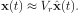

Inserting this into the FOM and multiplying both sides by the transpose of _V__r_ yields

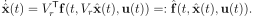

This new system is _r_-dimensional in the sense that

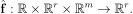

If the FOM operator **f** is known and has a nice structure, this reduced system can be solved cheaply by precomputing any involved matrices and then applying a time-stepping scheme.
For example, if **f** is linear in **x** and there is no input **u**, then

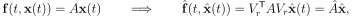

where

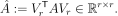

However, _this approach breaks down if the FOM operator **f** is unknown, uncertain, or highly nonlinear_.

## Operator Inference via Least Squares

Instead of directly computing the reduced operators, the Operator Inference framework takes a data-driven approach: assuming a specific structure of the ROM (linear, quadratic, etc.), solve for the involved operators that best fit the data.
For example, suppose that we seek a ROM of the form

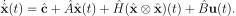

We have only the snapshot matrix _X_, the low-rank basis matrix _V__r_ (which was derived from _X_), the inputs _U_, and perhaps the snapshot velocities _X'_ (if not, these must be approximated).
Here the (_ij_)th entry of _U_ is the _i_th component of **u** at the time corresponding to the _j_th snapshot.
To solve for the linear operators on the right-hand side of the preceding equation, we project the snapshot data via the basis matrix,

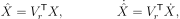

then solve the least squares problem

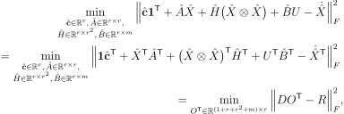

where **1** is a _k_-vector of 1's and

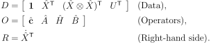

For our purposes, the ⊗ operator between matrices denotes a column-wise Kronecker product (also called the [Khatri-Rao product](https://en.wikipedia.org/wiki/Kronecker_product#Khatri%E2%80%93Rao_product)).
The minimization problem given above decouples into _r_ independent ordinary least-squares problems, one for each of the columns of _OT_:

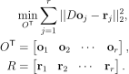

The entire routine is relatively inexpensive to solve.
The code also allows for a Tikhonov regularization matrix or list of matrices (the `P` keyword argument for `predict()` methods), in which case the problem being solved is

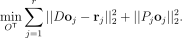

It can be shown [\[1\]](https://www.sciencedirect.com/science/article/pii/S0045782516301104) that, under some idealized assumptions, these inferred operators converge to the operators computed by explicit projection.
The key idea, however, is that _the inferred operators can be cheaply computed without knowing the full-order model_.
This is very convenient in situations where the FOM is given by a "black box," such as a legacy code for complex fluid simulations.

#### The Discrete Case

The framework described above can also be used to construct reduced-order models for approximating _discrete_ dynamical systems.
For instance, consider the full-order model

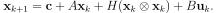

Instead of collecting snapshot velocities, we collect _k+1_ snapshots and let _X_ be the _n x k_ matrix whose columns are the first _k_ snapshots and _X'_ be the _n x k_ matrix whose columns are the last _k_ snapshots.
That is, the columns **x**_k_ of _X_ and **x**_k_' satisfy

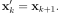

Then we set up the same least squares problem as before, but now the right-hand side matrix is

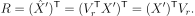

The resulting reduced-order model has the form

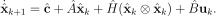

<!-- TODO: #### Re-projection and Recovering Intrusive Models -->

#### Implementation Note: The Kronecker Product

The vector [Kronecker product](https://en.wikipedia.org/wiki/Kronecker_product) ⊗ introduces some redundancies.
For example, the product **x** ⊗ **x** contains both _x_1_x_2 and _x_2_x_1.
To avoid these redundancies, we introduce a "compact" Kronecker product 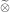 which only computes the unique terms of the usual vector Kronecker product:

When the compact Kronecker product is used, we call the resulting operator _Hc_ instead of _H_.
Thus, the reduced order model becomes

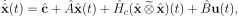

and the corresponding Operator Inference least squares problem is

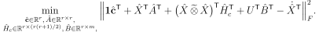

## Index of Notation

We generally denote scalars in lower case, vectors in bold lower case, matrices in upper case, and indicate low-dimensional quantities with a hat.
In the code, a low-dimensional quantity ends with an underscore, so that the model classes follow some principles from the [scikit-learn](https://scikit-learn.org/stable/index.html) [API](https://scikit-learn.org/stable/developers/contributing.html#apis-of-scikit-learn-objects).

### Dimensions

| Symbol | Code | Description |
| :----: | :--- | :---------- |
| 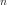 | `n`  | Dimension of the full-order system (large) |
| 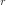 | `r`  | Dimension of the reduced-order system (small) |
| 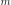 | `m`  | Dimension of the input **u** |
| 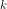 | `k`  | Number of state snapshots, i.e., the number of training points |
| 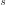 | `s`  | Number of parameter samples for parametric training |
| 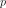 | `p` | Dimension of the parameter space |
| 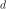 | `d` | Number of columns of the data matrix _D_ |
| 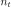 | `nt`  | Number of time steps in a simulation |

<!-- |  | `l` | Dimension of the output **y** | -->

### Vectors

<!-- \sigma_j\in\text{diag}(\Sigma) &= \textrm{singular value of }X\\
\boldsymbol{\mu}\in\mathcal{P} &= \text{system parameter}\\
\mathcal{P}\subset\mathbb{R}^{p} &= \text{parameter space}\\
\Omega\subset\mathbb{R}^{d} &= \text{spatial domain}\\
% \omega\in\Omega &= \text{spatial point (one dimension)}\\
\boldsymbol{\omega}\in\Omega &= \text{spatial point}\\
t\ge 0 &= \text{time}\\
\hat{} &= \textrm{reduced variable, e.g., }\hat{\mathbf{x}}\textrm{ or }\hat{A}\\
\dot{} = \frac{d}{dt} &= \text{time derivative} -->

| Symbol | Code | Size | Description |
| :----: | :--- | :--: | :---------- |
| 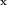 | `x` |  | Full-order state vector |
| 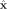 | `x_` |  | Reduced-order state vector |
| 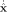 | `xdot_` |  | Reduced-order state velocity vector |
| 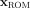 | `x_ROM` |  | Approximation to **x** produced by ROM |
| 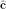 | `c_` |  | Learned constant term  |
|  | `u` |  | Input vector  |
| 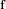 | `f(t,x,u)` |   | Full-order system operator |
| 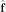 | `f_(t,x_,u)` |   | Reduced-order system operator |
| 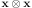 | `np.kron(x,x)` | 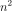 | Kronecker product of full state (quadratic terms) |
| 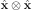 | `np.kron(x_,x_)` | 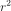  | Kronecker product of reduced state (quadratic terms) |
| 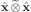 | `kron2c(x_)` | 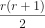  | Compact Kronecker product of reduced state (quadratic terms) |
| 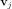 | `vj` |  | _j_th subspace basis vector, i.e., column _j_ of _V__r_ |

<!-- | **y**  | `y`             | Output vector | -->
<!-- | **y_ROM**, **y~** | `y_ROM`      | Approximation to **y** produced by ROM | -->

### Matrices

| Symbol | Code | Shape | Description |
| :----: | :--- | :---: | :---------- |
| 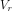 | `Vr` | 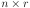 | low-rank basis of rank _r_ (usually the POD basis) |
| 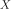 | `X` |  | Snapshot matrix |
| 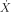 | `Xdot` |  | Snapshot velocity matrix |
| 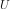 | `U` |  | Input matrix (inputs corresonding to the snapshots) |
|  | `X_` |  | Projected snapshot matrix |
|  | `Xdot_` |  | Projected snapshot velocity matrix |
|  | `D` |  | Data matrix |
|  | `O` |  | Operator matrix |
|  | `R` |  | Right-hand side matrix |
|  | `P` |  | Tikhonov regularization matrix |
|  | `A_` |  | Learned state matrix |
|  | `H_` |  | Learned matricized quadratic tensor |
|  | `Hc_` |  | Learned matricized quadratic tensor without redundancy (compact) |
|  | `G_` |  | Learned matricized cubic tensor |
|  | `Gc_` |  | Learned matricized cubic tensor without redundancy (compact) |
|  | `B_` |  | Learned input matrix |

<!-- |  | `Ni_` |  | Bilinear state-input matrix for _i_th input | -->

<!-- |  | `C_` |  | Learned output matrix | -->

<!-- I_{a\times%20a}\in\mathbb{R}^{a\times a} | | identity matrix\\ -->
<!-- \Sigma \in \mathbb{R}^{\ell\times\ell} &= \text{diagonal singular value matrix}\\ -->

## References

- \[1\] Peherstorfer, B. and Willcox, K.,
[Data-driven operator inference for non-intrusive projection-based model reduction.](https://www.sciencedirect.com/science/article/pii/S0045782516301104)
_Computer Methods in Applied Mechanics and Engineering_, Vol. 306, pp. 196-215, 2016.
([Download](https://kiwi.oden.utexas.edu/papers/Non-intrusive-model-reduction-Peherstorfer-Willcox.pdf))

BibTeX
<pre>
@article{Peherstorfer16DataDriven,
    title     = {Data-driven operator inference for nonintrusive projection-based model reduction},
    author    = {Peherstorfer, B. and Willcox, K.},
    journal   = {Computer Methods in Applied Mechanics and Engineering},
    volume    = {306},
    pages     = {196--215},
    year      = {2016},
    publisher = {Elsevier}
}</pre>

- \[2\] Qian, E., Kramer, B., Marques, A., and Willcox, K.,
[Transform & Learn: A data-driven approach to nonlinear model reduction](https://arc.aiaa.org/doi/10.2514/6.2019-3707).
In the AIAA Aviation 2019 Forum & Exhibition, Dallas, TX, June 2019. ([Download](https://kiwi.oden.utexas.edu/papers/learn-data-driven-nonlinear-reduced-model-Qian-Willcox.pdf))

BibTeX
<pre>
@inbook{QKMW2019aviation,
    title     = {Transform \\& Learn: A data-driven approach to nonlinear model reduction},
    author    = {Qian, E. and Kramer, B. and Marques, A. N. and Willcox, K. E.},
    booktitle = {AIAA Aviation 2019 Forum},
    doi       = {10.2514/6.2019-3707},
    URL       = {https://arc.aiaa.org/doi/abs/10.2514/6.2019-3707},
    eprint    = {https://arc.aiaa.org/doi/pdf/10.2514/6.2019-3707}
}</pre>

- \[3\] Swischuk, R., Mainini, L., Peherstorfer, B., and Willcox, K.,
[Projection-based model reduction: Formulations for physics-based machine learning.](https://www.sciencedirect.com/science/article/pii/S0045793018304250)
_Computers & Fluids_, Vol. 179, pp. 704-717, 2019.
([Download](https://kiwi.oden.utexas.edu/papers/Physics-based-machine-learning-swischuk-willcox.pdf))

BibTeX
<pre>
@article{swischuk2019projection,
    title     = {Projection-based model reduction: Formulations for physics-based machine learning},
    author    = {Swischuk, R. and Mainini, L. and Peherstorfer, B. and Willcox, K.},
    journal   = {Computers \\& Fluids},
    volume    = {179},
    pages     = {704--717},
    year      = {2019},
    publisher = {Elsevier}
}</pre>

- \[4\] Swischuk, R., [Physics-based machine learning and data-driven reduced-order modeling](https://dspace.mit.edu/handle/1721.1/122682). Master's thesis, Massachusetts Institute of Technology, 2019. ([Download](https://dspace.mit.edu/bitstream/handle/1721.1/122682/1123218324-MIT.pdf))

BibTeX
<pre>
@phdthesis{swischuk2019physics,
    title  = {Physics-based machine learning and data-driven reduced-order modeling},
    author = {Swischuk, Renee},
    year   = {2019},
    school = {Massachusetts Institute of Technology}
}</pre>

- \[5\] Peherstorfer, B. [Sampling low-dimensional Markovian dynamics for pre-asymptotically recovering reduced models from data with operator inference](https://arxiv.org/abs/1908.11233). arXiv:1908.11233.
([Download](https://arxiv.org/pdf/1908.11233.pdf))

BibTeX
<pre>
@article{peherstorfer2019sampling,
    title   = {Sampling low-dimensional Markovian dynamics for pre-asymptotically recovering reduced models from data with operator inference},
    author  = {Peherstorfer, Benjamin},
    journal = {arXiv preprint arXiv:1908.11233},
    year    = {2019}
}</pre>

- \[6\] Swischuk, R., Kramer, B., Huang, C., and Willcox, K., [Learning physics-based reduced-order models for a single-injector combustion process](https://arc.aiaa.org/doi/10.2514/1.J058943). _AIAA Journal_, published online March 2020. Also in Proceedings of 2020 AIAA SciTech Forum & Exhibition, Orlando FL, January, 2020. Also Oden Institute Report 19-13. ([Download](https://kiwi.oden.utexas.edu/papers/learning-reduced-model-combustion-Swischuk-Kramer-Huang-Willcox.pdf))

BibTeX
<pre>
@article{SKHW2019_learning_ROMs_combustor,
    title   = {Learning physics-based reduced-order models for a single-injector combustion process},
    author  = {Swischuk, R. and Kramer, B. and Huang, C. and Willcox, K.},
    journal = {AIAA Journal},
    volume  = {},
    pages   = {Published Online: 19 Mar 2020},
    url     = {},
    year    = {2020}
}</pre>

- \[7\] Qian, E., Kramer, B., Peherstorfer, B., and Willcox, K. [Lift & Learn: Physics-informed machine learning for large-scale nonlinear dynamical systems](https://www.sciencedirect.com/science/article/abs/pii/S0167278919307651). _Physica D: Nonlinear Phenomena_, Volume 406, May 2020, 132401. ([Download](https://kiwi.oden.utexas.edu/papers/lift-learn-scientific-machine-learning-Qian-Willcox.pdf))

BibTeX
<pre>
@article{QKPW2020_lift_and_learn,
    title   = {Lift \\& Learn: Physics-informed machine learning for large-scale nonlinear dynamical systems.},
    author  = {Qian, E. and Kramer, B. and Peherstorfer, B. and Willcox, K.},
    journal = {Physica {D}: {N}onlinear {P}henomena},
    volume  = {406},
    pages   = {132401},
    url     = {https://doi.org/10.1016/j.physd.2020.132401},
    year    = {2020}
}</pre>

- \[8\] Benner, P., Goyal, P., Kramer, B., Peherstorfer, B., and Willcox, K. [Operator inference for non-intrusive model reduction of systems with non-polynomial nonlinear terms](https://arxiv.org/abs/2002.09726). arXiv:2002.09726. Also Oden Institute Report 20-04. ([Download](https://kiwi.oden.utexas.edu/papers/Non-intrusive-nonlinear-model-reduction-Benner-Goyal-Kramer-Peherstorfer-Willcox.pdf))

BibTeX
<pre>
@article{benner2020operator,
    title   = {Operator inference for non-intrusive model reduction of systems with non-polynomial nonlinear terms},
    author  = {Benner, P. and Goyal, P. and Kramer, B. and Peherstorfer, B. and Willcox, K.},
    journal = {arXiv preprint arXiv:2002.09726},
    year    = {2020}
}</pre>

