# Documentation

This document contains code documentation for `rom_operator_inference` classes and functions.
[The code itself](rom_operator_inference/) is also internally documented and can be accessed on the fly with dynamic object introspection.

**Contents**
- [**ROM Classes**](#rom-classes)
    - [**InferredContinuousROM**](#inferredcontinuousrom)
    - [**InferredDiscreteROM**](#inferreddiscreterom)
    - [**InterpolatedInferredContinuousROM**](#interpolatedinferredcontinuousrom)
    - [**InterpolatedInferredDiscreteROM**](#interpolatedinferreddiscreterom)
    - [**IntrusiveContinuousROM**](#intrusivecontinuousrom)
    - [**IntrusiveDiscreteROM**](#intrusivediscreterom)
    - [**AffineIntrusiveContinuousROM**](#affineintrusivecontinuousrom)
    - [**AffineIntrusiveDiscreteROM**](#affineintrusivediscreterom)
- [**Preprocessing**](#preprocessing-tools)
- [**Postprocessing**](#postprocessing-tools)
- [**Utility Functions**](#utility-functions)
- [**Index of Notation**](#index-of-notation)
- [**References**](#references)

<!-- **TODO**: The complete documentation at _\<insert link to sphinx-generated readthedocs page\>_. -->
<!-- Here we include a short catalog of functions and their inputs. -->

## ROM Classes

The core of `rom_operator_inference` is highly object oriented and defines several `ROM` classes that serve as the workhorse of the package.
The API for these classes adopts some principles from the [scikit-learn](https://scikit-learn.org/stable/index.html) [API](https://scikit-learn.org/stable/developers/contributing.html#apis-of-scikit-learn-objects): there are `fit()` and `predict()` methods, hyperparameters are set in the constructor, estimated attributes end with underscore, and so on.

Each class corresponds to a type of full-order model (continuous vs. discrete, non-parametric vs. parametric) and a strategy for constructing the ROM.

| Class Name | Problem Statement | ROM Strategy |
| :--------- | :---------------: | :----------- |
| `InferredContinuousROM` |  | Operator Inference |
| `InferredDiscreteROM` | 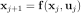 | Operator Inference |
| `InterpolatedInferredContinuousROM` |  | Operator Inference |
| `InterpolatedInferredDiscreteROM` | 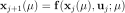 | Operator Inference |
| `IntrusiveContinuousROM` |  | Intrusive Projection |
| `IntrusiveDiscreteROM` |  | Intrusive Projection |
| `AffineIntrusiveContinuousROM` |  | Intrusive Projection |
| `AffineIntrusiveDiscreteROM` | 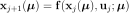 | Intrusive Projection |

<!-- | `AffineInferredContinuousROM` |  | Operator Inference | -->
<!-- | `AffineInferredDiscreteROM` |  | Operator Inference | -->

<!-- More classes will be added in the future. -->
The following function may be helpful for selecting an appropriate class.

**`select_model(time, rom_strategy, parametric=False)`**: select the appropriate ROM model class for the situation.
Parameters:
- `time`: The type of full-order model to be reduced, either `"continuous"` or `"discrete"`.
- `rom_strategy`: Whether to use Operator Inference (`"inferred"`) or intrusive projection (`"intrusive"`) to compute the operators of the reduced model.
- `parametric`: Whether or not the model depends on an external parameter, and how to handle the parametric dependence. Options:
    - `False` (default): the problem is nonparametric.
    - `"interpolated"`: construct individual models for each sample parameter and [interpolate them](#interpolatedinferredcontinuousrom) for general parameter inputs. Only valid for `rom_strategy="inferred"`, and only when the parameter is a scalar.
    - `"affine"`: one or more operators in the problem [depends affinely](#affineintrusivecontinuousrom) on the parameter. Only valid for `rom_strategy="intrusive"`.

The return value is the class type for the situation, e.g., `InferredContinuousROM`.

### Constructor

All `ROM` classes are instantiated with a single argument, `modelform`, which is a string denoting the structure of the full-order operator **f**.
Each character in the string corresponds to a single term of the operator, given in the following table.

| Character | Name | Continuous Term | Discrete Term |
| :-------- | :--- | :-------------- | :------------ |
| `c` | Constant | 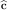 |  |
| `A` | Linear |  | 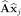 |
| `H` | Quadratic | 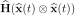 |  |
| `G` | Cubic | 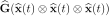 |  |
| `B` | Input | 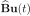 | 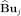 |


<!-- | `C` | Output |  |  | -->

These are all input as a single string.
Examples:

| `modelform` | Continuous ROM Structure | Discrete ROM Structure |
| :---------- | :----------------------- | ---------------------- |
|  `"A"`   |  | 
|  `"cA"`  |  | 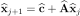
|  `"HB"`  |  | 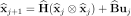
|  `"cAHB"` |  | 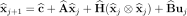

### Attributes

All `ROM` classes have the following attributes.

- Structure of model:
    - `modelform`: set in the [constructor](#constructor).
    - `has_constant`: boolean, whether or not there is a constant term **c**.
    - `has_linear`: boolean, whether or not there is a linear term **Ax**.
    - `has_quadratic`: boolean, whether or not there is a quadratic term **H**(**x**⊗**x**).
    - `has_cubic`: boolean, whether or not there is a cubic term **G**(**x**⊗**x**⊗**x**).
    - `has_inputs`: boolean, whether or not there is an input term **Bu**.
    <!-- - `has_outputs`: boolean, whether or not there is an output **Cx**_. -->

- Dimensions, learned in `fit()`:
    - `n`: The dimension of the original model
    - `r`: The dimension of the learned reduced-order model
    - `m`: The dimension of the input **u**, or `None` if `'B'` is not in `modelform`.
    <!-- - `l`: The dimension of the output **y**, or `None` if `has_outputs` is `False`. -->

- Reduced operators `c_`, `A_`, `H_`, `Hc_`, `G_`, `Gc_`, and `B_`, learned in `fit()`: the [NumPy](https://numpy.org/) arrays corresponding to the learned parts of the reduced-order model.
Set to `None` if the operator is not included in the prescribed `modelform` (e.g., if `modelform="AHG"`, then `c_` and `B_` are `None`).

- Basis matrix `Vr`: the _n_ x _r_ basis defining the mapping between the _n_-dimensional space of the full-order model and the reduced _r_-dimensional subspace of the reduced-order model (e.g., POD basis).
This is the first input to all `fit()` methods.
To save memory, inferred (but not intrusive) ROM classes allow entering `Vr=None`, which then assumes that other inputs for training are already projected to the _r_-dimensional subspace (e.g., **V**<sub>_r_</sub><sup>T</sup>**X** instead of **X**).

- Reduced model function `f_`, learned in `fit()`: the ROM function, defined by the reduced operators listed above.
For continuous models, `f_` has the following signature:
```python
def f_(t, x_, u):
    """ROM function for continuous models.

    Parameters
    ----------
    t : float
        Time, a scalar.

    x_ : (r,) ndarray
        Reduced state vector.

    u : func(float) -> (m,)
        Input function that maps time `t` to an input vector of length m.
    """
```
For discrete models, the signature is the following.
```python
def f_(x_, u):
    """ROM function for discrete models.

    Parameters
    ----------
    x_ : (r,) ndarray
        Reduced state vector.

    u : (m,) ndarray
        Input vector of length m corresponding to the state.
    """
```
The input argument `u` is **only** present if `B` is in `modelform`.
Therefore, the signature of `f_` is one of the following.
|                | Continuous   | Discrete   |
| -------------: | :----------- | ---------- |
| **Has inputs** | `f_(t,x_,u)` | `f_(x_,u)` |
| **No inputs**  | `f_(t,x_)`   | `f_(x_)`   |

### Model Persistence

Trained ROM objects can be saved in [HDF5 format](http://docs.h5py.org/en/stable/index.html) with the `save_model()` method, and recovered later with the `load_model()` function.
Such files store metadata for the model class and structure, the reduced-order model operators (`c_`, `A_`, etc.), other attributes learned in `fit()`, and (optionally) the basis `Vr`.

**`load_model(loadfile)`**: Load a serialized model from an HDF5 file, created previously from a ROM object's `save_model()` method.

**`ROMclass.save_model(savefile, save_basis=True, overwrite=False)`**: Serialize the learned model, saving it in HDF5 format. The model can then be loaded with `load_model()`. _Currently implemented for nonparametric classes only._ Parameters:
- `savefile`: The file to save to. If it does not end with `'.h5'`, this extension will be tacked on to the end.
- `savebasis`: If `True`, save the basis `Vr` as well as the reduced operators. If `False`, only save reduced operators.
- `overwrite`: If `True` and the specified file already exists, overwrite the file. If `False` and the specified file already exists, raise an error.

```python
>>> import rom_operator_inference as roi

# Assume model is a trained roi.InferredContinuousROM object.
>>> model.save_model("trained_rom.h5")          # Save a trained model.
>>> model2 = roi.load_model("trained_rom.h5")   # Load a model from file.
```

### InferredContinuousROM

This class constructs a reduced-order model for the continuous, nonparametric system

<p align="center">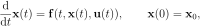</p>

via Operator Inference [\[1\]](#references).
That is, given snapshot data, a basis, and a form for a reduced model, it computes the reduced model operators by solving an ordinary least-squares problem (see [DETAILS.md](DETAILS.md)).

**`InferredContinuousROM.fit(Vr, X, Xdot, U=None, P=0)`**: Compute the operators of the reduced-order model that best fit the data.
- **Parameters**
    - `Vr`: The _n_ x _r_ basis for the linear reduced space on which the full-order model will be projected (for example, a POD basis matrix; see [`pre.pod_basis()`](#preprocessing-tools)). Each column is a basis vector. The column space of `Vr` should be a good approximation of the column space of the full-order snapshot matrix `X`. If given as `None`, `X` is assumed to be the projected snapshot matrix **V**<sub>_r_</sub><sup>T</sup>**X** and `Xdot` is assumed to be the projected time derivative matrix.
    - `X`: An _n_ x _k_ snapshot matrix of solutions to the full-order model, or the _r_ x _k_ projected snapshot matrix **V**<sub>_r_</sub><sup>T</sup>**X**. Each column is one snapshot.
    - `Xdot`: The _n_ x _k_ snapshot time derivative matrix for the full-order model, or the _r_ x _k_ projected snapshot time derivative matrix. Each column is the time derivative d**x**/dt for the corresponding column of `X`. See the [`pre`](#preprocessing-tools) submodule for some simple derivative approximation tools.
    - `U`: The _m_ x _k_ input matrix (or a _k_-vector if _m_ = 1). Each column is the input vector for the corresponding column of `X`. Only required when `'B'` is in `modelform`.
    - `P`: Tikhonov regularization factor for the least-squares problem; see [`utils.lstsq_reg()`](#utility-functions).
- **Returns**
    - The trained `InferredContinuousROM` object.

**`InferredContinuousROM.predict(x0, t, u=None, **options)`**: Simulate the learned reduced-order model with [`scipy.integrate.solve_ivp()`](https://docs.scipy.org/doc/scipy/reference/generated/scipy.integrate.solve_ivp.html).
- **Parameters**
    - `x0`: The initial state vector, either full order (_n_-vector) or projected to reduced order (_r_-vector). If `Vr=None` in `fit()`, this must be the projected initial state **V**<sub>_r_</sub><sup>T</sup>**x**<sub>0</sub>.
    - `t`: The time domain, an _n_<sub>_t_</sub>-vector, over which to integrate the reduced-order model.
    - `u`: The input as a function of time, that is, a function mapping a `float` to an _m_-vector (or to a scalar if _m_ = 1). Alternatively, the _m_ x _n_<sub>_t_</sub> matrix (or _n_<sub>_t_</sub>-vector if _m_ = 1) where column _j_ is the input vector corresponding to time `t[j]`. In this case, **u**(_t_) is approximated by a cubic spline interpolating the given inputs. This argument is only required if `'B'` is in `modelform`.
    - Other keyword arguments for [`scipy.integrate.solve_ivp()`](https://docs.scipy.org/doc/scipy/reference/generated/scipy.integrate.solve_ivp.html).
- **Returns**
    - `X_ROM`: The _n_ x _n_<sub>_t_</sub> matrix of approximate solution to the full-order system over `t`, or, if `Vr=None` in `fit()`, the _r_ x _n_<sub>_t_</sub> solution in the reduced-order space. Each column is one snapshot of the solution.


### InferredDiscreteROM

This class constructs a reduced-order model for the discrete, nonparametric system

<p align="center"></p>

via Operator Inference.

**`InferredDiscreteROM.fit(Vr, X, U=None, P=0)`**: Compute the operators of the reduced-order model that best fit the data.
- **Parameters**
    - `Vr`: The _n_ x _r_ basis for the linear reduced space on which the full-order model will be projected. Each column is a basis vector. The column space of `Vr` should be a good approximation of the column space of the full-order snapshot matrix `X`. If given as `None`, `X` is assumed to be the projected snapshot matrix **V**<sub>_r_</sub><sup>T</sup>**X**.
    - `X`: An _n_ x _k_ snapshot matrix of solutions to the full-order model, or the _r_ x _k_ projected snapshot matrix **V**<sub>_r_</sub><sup>T</sup>**X**. Each column is one snapshot.
    - `U`: The _m_ x _k-1_ input matrix (or a (_k_-1)-vector if _m_ = 1). Each column is the input for the corresponding column of `X`. Only required when `'B'` is in `modelform`.
    - `P`: Tikhonov regularization factor for the least-squares problem; see [`utils.lstsq_reg()`](#utility-functions).
- **Returns**
    - The trained `InferredDiscreteROM` object.

**`InferredDiscreteROM.predict(x0, niters, U=None)`**: Step forward the learned ROM `niters` steps.
- **Parameters**
    - `x0`: The initial state vector, either full order (_n_-vector) or projected to reduced order (_r_-vector). If `Vr=None` in `fit()`, this must be the projected initial state **V**<sub>_r_</sub><sup>T</sup>**x**<sub>0</sub>.
    - `niters`: The number of times to step the system forward.
    - `U`: The inputs for the next `niters`-1 time steps, as an _m_ x `niters`-1 matrix (or an (`niters`-1)-vector if _m_ = 1). This argument is only required if `'B'` is in `modelform`.
- **Returns**
    - `X_ROM`: The _n_ x `niters` matrix of approximate solutions to the full-order system, including the initial condition; or, if `Vr=None` in `fit()`, the _r_ x `niters` solution in the reduced-order space. Each column is one iteration of the solution.


### InterpolatedInferredContinuousROM

This class constructs a reduced-order model for the continuous, parametric system
<p align="center">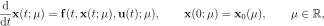</p>

via Operator Inference.
The strategy is to take snapshot data for several parameter samples and a global basis, compute a reduced model for each parameter sample via Operator Inference, then construct a general parametric model by interpolating the entries of the inferred operators [\[1\]](#references).

**`InterpolatedInferredContinuousROM.fit(Vr, µs, Xs, Xdots, Us=None, P=0)`**: Compute the operators of the reduced-order model that best fit the data.
- **Parameters**
    - `Vr`: The (global) _n_ x _r_ basis for the linear reduced space on which the full-order model will be projected. Each column is a basis vector. The column space of `Vr` should be a good approximation of the column space of the full-order snapshot matrices `Xs`. If given as `None`, `Xs` is assumed to be the list of the projected snapshot matrices **V**<sub>_r_</sub><sup>T</sup>**X**<sub>_i_</sub> and `Xdots` is assumed to be the list of projected time derivative matrices.
    - `µs`: The _s_ parameter values corresponding to the snapshot sets.
    - `Xs`: List of _s_ snapshot matrices, each _n_ x _k_ (full-order solutions) or _r_ x _k_ (projected solutions). The _i_th array `Xs[i]` corresponds to the _i_th parameter, `µs[i]`; each column each of array is one snapshot.
    - `Xdots`: List of _s_ snapshot time derivative matrices, each _n_ x _k_ (full-order velocities) or _r_ x _k_ (projected velocities).  The _i_th array `Xdots[i]` corresponds to the _i_th parameter, `µs[i]`. The _j_th column of the _i_th array, `Xdots[i][:,j]`, is the time derivative d**x**/dt for the corresponding snapshot column `Xs[i][:,j]`.
    - `Us`: List of _s_ input matrices, each _m_ x _k_ (or a _k_-vector if _m_=1). The _i_th array `Us[i]` corresponds to the _i_th parameter, `µs[i]`. The _j_th column of the _i_th array, `Us[i][:,j]`, is the input for the corresponding snapshot `Xs[i][:,j]`. Only required when `'B'` is in `modelform`.
    - `P`: Tikhonov regularization factor for the least-squares problem; see [`utils.lstsq_reg()`](#utility-functions).
- **Returns**
    - The trained `InterpolatedInferredContinuousROM` object.

**`InterpolatedInferredContinuousROM.predict(µ, x0, t, u=None, **options)`**: Simulate the learned reduced-order model with [`scipy.integrate.solve_ivp()`](https://docs.scipy.org/doc/scipy/reference/generated/scipy.integrate.solve_ivp.html).
- **Parameters**
    - `µ`: The parameter value at which to simulate the ROM.
    - `x0`: The initial state vector, either full order (_n_-vector) or projected to reduced order (_r_-vector). If `Vr=None` in `fit()`, this must be the projected initial state **V**<sub>_r_</sub><sup>T</sup>**x**<sub>0</sub>.
    - `t`: The time domain, an _n_<sub>_t_</sub>-vector, over which to integrate the reduced-order model.
    - `u`: The input as a function of time, that is, a function mapping a `float` to an _m_-vector (or to a scalar if _m_ = 1). Alternatively, the _m_ x _n_<sub>_t_</sub> matrix (or _n_<sub>_t_</sub>-vector if _m_ = 1) where column _j_ is the input vector corresponding to time `t[j]`. In this case, **u**(_t_) is approximated by a cubic spline interpolating the given inputs. This argument is only required if `'B'` is in `modelform`.
    - Other keyword arguments for [`scipy.integrate.solve_ivp()`](https://docs.scipy.org/doc/scipy/reference/generated/scipy.integrate.solve_ivp.html).
- **Returns**
    - `X_ROM`: The _n_ x _n_<sub>_t_</sub> matrix of approximate solution to the full-order system over `t`, or, if `Vr=None` in `fit()`, the _r_ x _n_<sub>_t_</sub> solution in the reduced-order space. Each column is one snapshot of the solution.


### InterpolatedInferredDiscreteROM

This class constructs a reduced-order model for the continuous, parametric system
<p align="center">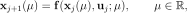</p>

via Operator Inference.
The strategy is to take snapshot data for several parameter samples and a global basis, compute a reduced model for each parameter sample via Operator Inference, then construct a general parametric model by interpolating the entries of the inferred operators [\[1\]](#references).

**`InterpolatedInferredDiscreteROM.fit(Vr, µs, Xs, Us=None, P=0)`**: Compute the operators of the reduced-order model that best fit the data.
- **Parameters**
    - `Vr`: The (global) _n_ x _r_ basis for the linear reduced space on which the full-order model will be projected. Each column is a basis vector. The column space of `Vr` should be a good approximation of the column space of the full-order snapshot matrices `Xs`. If given as `None`, `Xs` is assumed to be the list of the projected snapshot matrices **V**<sub>_r_</sub><sup>T</sup>**X**<sub>_i_</sub>.
    - `µs`: The _s_ parameter values corresponding to the snapshot sets.
    - `Xs`: List of _s_ snapshot matrices, each _n_ x _k_ (full-order solutions) or _r_ x _k_ (projected solutions). The _i_th array `Xs[i]` corresponds to the _i_th parameter, `µs[i]`; each column each of array is one snapshot.
    - `Us`: List of _s_ input matrices, each _m_ x _k_ (or a _k_-vector if _m_=1). The _i_th array `Us[i]` corresponds to the _i_th parameter, `µs[i]`. The _j_th column of the _i_th array, `Us[i][:,j]`, is the input for the corresponding snapshot `Xs[i][:,j]`. Only required when `'B'` is in `modelform`.
    - `P`: Tikhonov regularization factor for the least-squares problem; see [`utils.lstsq_reg()`](#utility-functions).
- **Returns**
    - The trained `InterpolatedInferredDiscreteROM` object.

**`InterpolatedInferredDiscreteROM.predict(µ, x0, niters, U=None)`**: Step forward the learned ROM `niters` steps.
- **Parameters**
    - `µ`: The parameter value at which to simulate the ROM.
    - `x0`: The initial state vector, either full order (_n_-vector) or projected to reduced order (_r_-vector). If `Vr=None` in `fit()`, this must be the projected initial state **V**<sub>_r_</sub><sup>T</sup>**x**<sub>0</sub>.
    - `niters`: The number of times to step the system forward.
    - `U`: The inputs for the next `niters`-1 time steps, as an _m_ x `niters`-1 matrix (or an (`niters`-1)-vector if _m_ = 1). This argument is only required if `'B'` is in `modelform`.
- **Returns**
    - `X_ROM`: The _n_ x `niters` matrix of approximate solutions to the full-order system, including the initial condition; or, if `Vr=None` in `fit()`, the _r_ x _n_<sub>_t_</sub> solution in the reduced-order space. Each column is one iteration of the solution.


### IntrusiveContinuousROM

This class constructs a reduced-order model for the continuous, nonparametric system

<p align="center"></p>

via intrusive projection, i.e.,

<p align="center">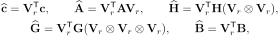</p>

where ⊗ denotes the full matrix Kronecker product.
The class requires the actual full-order operators (**c**, **A**, **H**, **G**, and/or **B**) that define **f**.

**`IntrusiveContinuousROM.fit(Vr, operators)`**: Compute the operators of the reduced-order model by projecting the operators of the full-order model.
- **Parameters**
    - `Vr`: The _n_ x _r_ basis for the linear reduced space on which the full-order operators will be projected.
    - `operators`: A dictionary mapping labels to the full-order operators that define **f**. The operators are indexed by the entries of `modelform`; for example, if `modelform="cHB"`, then `operators={'c':c, 'H':H, 'B':B}`.
- **Returns**
    - The trained `IntrusiveContinuousROM` object.

**`IntrusiveContinuousROM.predict(x0, t, u=None, **options)`**: Simulate the learned reduced-order model with [`scipy.integrate.solve_ivp()`](https://docs.scipy.org/doc/scipy/reference/generated/scipy.integrate.solve_ivp.html).
- **Parameters**
    - `x0`: The initial state vector, either full order (_n_-vector) or projected to reduced order (_r_-vector).
    - `t`: The time domain, an _n_<sub>_t_</sub>-vector, over which to integrate the reduced-order model.
    - `u`: The input as a function of time, that is, a function mapping a `float` to an _m_-vector (or to a scalar if _m_ = 1). Alternatively, the _m_ x _n_<sub>_t_</sub> matrix (or _n_<sub>_t_</sub>-vector if _m_ = 1) where column _j_ is the input vector corresponding to time `t[j]`. In this case, **u**(_t_) is approximated by a cubic spline interpolating the given inputs. This argument is only required if `'B'` is in `modelform`.
    - Other keyword arguments for [`scipy.integrate.solve_ivp()`](https://docs.scipy.org/doc/scipy/reference/generated/scipy.integrate.solve_ivp.html).
- **Returns**
    - `X_ROM`: The _n_ x _n_<sub>_t_</sub> matrix of approximate solution to the full-order system over `t`. Each column is one snapshot of the solution.


### IntrusiveDiscreteROM

This class constructs a reduced-order model for the discrete, nonparametric system

<p align="center"></p>

via intrusive projection, i.e.,

<p align="center"></p>

The class requires the actual full-order operators (**c**, **A**, **H**, **G**, and/or **B**) that define **f**.

**`IntrusiveDiscreteROM.fit(Vr, operators)`**: Compute the operators of the reduced-order model by projecting the operators of the full-order model.
- **Parameters**
    - `Vr`: The _n_ x _r_ basis for the linear reduced space on which the full-order operators will be projected.
    - `operators`: A dictionary mapping labels to the full-order operators that define **f**. The operators are indexed by the entries of `modelform`; for example, if `modelform="cHB"`, then `operators={'c':c, 'H':H, 'B':B}`.
- **Returns**
    - The trained `IntrusiveDiscreteROM` object.

**`IntrusiveDiscreteROM.predict(x0, niters, U=None)`**: Step forward the learned ROM `niters` steps.
- **Parameters**
    - `x0`: The initial state vector, either full order (_n_-vector) or projected to reduced order (_r_-vector).
    - `niters`: The number of times to step the system forward.
    - `U`: The inputs for the next `niters`-1 time steps, as an _m_ x `niters`-1 matrix (or an (`niters`-1)-vector if _m_ = 1). This argument is only required if `'B'` is in `modelform`.
- **Returns**
    - `X_ROM`: The _n_ x `niters` matrix of approximate solutions to the full-order system, including the initial condition. Each column is one iteration of the solution.


### AffineIntrusiveContinuousROM

This class constructs a reduced-order model for the continuous, affinely parametric system

<p align="center">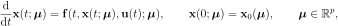</p>

where the operators that define **f** may only depend affinely on the parameter, e.g.,

<p align="center">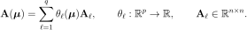</p>

The reduction is done via intrusive projection, i.e.,

<p align="center">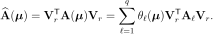</p>

The class requires the actual full-order operators (**c**, **A**, **H**, and/or **B**) that define **f** _and_ the functions that define any affine parameter dependencies (i.e., the _θ_<sub>_ℓ_</sub> functions).

**`AffineIntrusiveContinuousROM.fit(Vr, affines, operators)`**: Compute the operators of the reduced-order model by projecting the operators of the full-order model.
- **Parameters**
    - `Vr`: The _n_ x _r_ basis for the linear reduced space on which the full-order operators will be projected.
    - `affines` A dictionary mapping labels of the operators that depend affinely on the parameter to the list of functions that define that affine dependence. The keys are entries of `modelform`. For example, if the constant term has the affine structure **c**(_**µ**_) = _θ_<sub>1</sub>(_**µ**_)**c**<sub>1</sub> + _θ_<sub>2</sub>(_**µ**_)**c**<sub>2</sub> + _θ_<sub>3</sub>(_**µ**_)**c**<sub>3</sub>, then `'c' -> [θ1, θ2, θ3]`.
    - `operators`: A dictionary mapping labels to the full-order operators that define **f**. The keys are entries of `modelform`. Terms with affine structure should be given as a list of the component matrices. For example, suppose `modelform="cA"`. If **A** has the affine structure **A**(_**µ**_) = _θ_<sub>1</sub>(_**µ**_)**A**<sub>1</sub> + _θ_<sub>2</sub>(_**µ**_)**A**<sub>2</sub>, then `'A' -> [A1, A2]`. If **c** does not vary with the parameter, then `'c' -> c`, the complete full-order order.
- **Returns**:
    - The trained `AffineIntrusiveContinuousROM` object.

**`AffineIntrusiveContinuousROM.predict(µ, x0, t, u=None, **options)`**: Simulate the learned reduced-order model at the given parameter value with [`scipy.integrate.solve_ivp()`](https://docs.scipy.org/doc/scipy/reference/generated/scipy.integrate.solve_ivp.html).
- **Parameters**
    - `µ`: The parameter value at which to simulate the model.
    - `x0`: The initial state vector, either full order (_n_-vector) or projected to reduced order (_r_-vector).
    - `t`: The time domain, an _n_<sub>_t_</sub>-vector, over which to integrate the reduced-order model.
    - `u`: The input as a function of time, that is, a function mapping a `float` to an _m_-vector (or to a scalar if _m_ = 1). Alternatively, the _m_ x _n_<sub>_t_</sub> matrix (or _n_<sub>_t_</sub>-vector if _m_ = 1) where column _j_ is the input vector corresponding to time `t[j]`. In this case, **u**(_t_) is approximated by a cubic spline interpolating the given inputs. This argument is only required if `'B'` is in `modelform`.
    - Other keyword arguments for [`scipy.integrate.solve_ivp()`](https://docs.scipy.org/doc/scipy/reference/generated/scipy.integrate.solve_ivp.html).
- **Returns**
    - `X_ROM`: The _n_ x _n_<sub>_t_</sub> matrix of approximate solution to the full-order system over `t`. Each column is one snapshot of the solution.


### AffineIntrusiveDiscreteROM

This class constructs a reduced-order model for the continuous, affinely parametric system

<p align="center">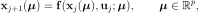</p>

where the operators that define **f** may only depend affinely on the parameter, e.g.,

<p align="center"></p>

The reduction is done via intrusive projection, i.e.,

<p align="center"></p>

The class requires the actual full-order operators (**c**, **A**, **H**, and/or **B**) that define **f** _and_ the functions that define any affine parameter dependencies (i.e., the _θ_<sub>_ℓ_</sub> functions).

**`AffineIntrusiveDiscreteROM.fit(Vr, affines, operators)`**: Compute the operators of the reduced-order model by projecting the operators of the full-order model.
- **Parameters**
    - `Vr`: The _n_ x _r_ basis for the linear reduced space on which the full-order operators will be projected.
    - `affines` A dictionary mapping labels of the operators that depend affinely on the parameter to the list of functions that define that affine dependence. The keys are entries of `modelform`. For example, if the constant term has the affine structure **c**(_**µ**_) = _θ_<sub>1</sub>(_**µ**_)**c**<sub>1</sub> + _θ_<sub>2</sub>(_**µ**_)**c**<sub>2</sub> + _θ_<sub>3</sub>(_**µ**_)**c**<sub>3</sub>, then `'c' -> [θ1, θ2, θ3]`.
    - `operators`: A dictionary mapping labels to the full-order operators that define **f**. The keys are entries of `modelform`. Terms with affine structure should be given as a list of the component matrices. For example, suppose `modelform="cA"`. If **A** has the affine structure **A**(_**µ**_) = _θ_<sub>1</sub>(_**µ**_)**A**<sub>1</sub> + _θ_<sub>2</sub>(_**µ**_)**A**<sub>2</sub>, then `'A' -> [A1, A2]`. If **c** does not vary with the parameter, then `'c' -> c`, the complete full-order order.
- **Returns**:
    - The trained `AffineIntrusiveDiscreteROM` object.

**`AffineIntrusiveDiscreteROM.predict(µ, x0, niters, U=None)`**: Step forward the learned ROM `niters` steps at the given parameter value.
- **Parameters**
    - `µ`: The parameter value at which to simulate the model.
    - `x0`: The initial state vector, either full order (_n_-vector) or projected to reduced order (_r_-vector).
    - `niters`: The number of times to step the system forward.
    - `U`: The inputs for the next `niters`-1 time steps, as an _m_ x `niters`-1 matrix (or an (`niters`-1)-vector if _m_ = 1). This argument is only required if `'B'` is in `modelform`.
- **Returns**
    - `X_ROM`: The _n_ x `niters` matrix of approximate solutions to the full-order system, including the initial condition. Each column is one iteration of the solution.


## Preprocessing Tools

The `pre` submodule is a collection of common routines for preparing data to be used by the `ROM` classes.
None of these routines are novel, but they may be instructive for new Python users.

**`pre.shift(X, shift_by=None)`**: Shift the columns of `X` by the vector `shift_by`. If `shift_by=None`, shift `X` by the mean of its columns.

**`pre.scale(X, scale_to, scale_from=None)`**: Scale the entries of `X` from the interval `[scale_from[0], scale_from[1]]` to the interval `[scale_to[0], scale_to[1]]`. If `scale_from=None`, learn the scaling by setting `scale_from[0] = min(X)`; `scale_from[1] = max(X)`.

<!-- TODO: kwarg for absolute vs minmax scaling -->

**`pre.pod_basis(X, r=None, mode="dense", **options)`**: Compute the POD basis of rank `r` and the associated singular values for a snapshot matrix `X`. If `r = None`, compute all singular vectors / values. This function simply wraps a few SVD methods, selected by `mode`:
- `mode="dense"`: [`scipy.linalg.svd()`](https://docs.scipy.org/doc/scipy/reference/generated/scipy.linalg.svd.html)
- `mode="sparse"`: [`scipy.sparse.linalg.svds()`](https://docs.scipy.org/doc/scipy/reference/generated/scipy.sparse.linalg.svds.html)
- `mode="randomized"`: [`sklearn.utils.extmath.randomized_svd()`](https://scikit-learn.org/stable/modules/generated/sklearn.utils.extmath.randomized_svd.html)

Use `**options` to specify additional parameters for these wrapped functions.

**`pre.svdval_decay(singular_values, eps, plot=False)`**: Count the number of singular values that are greater than `eps`. The singular values can be computed with, for example, `singular_values = scipy.linalg.svdvals(X)` where `X` is a snapshot matrix. If `plot=True`, plot the singular values on a log scale.

**`pre.cumulative_energy(singular_values, thresh, plot=False)`**: Compute the number of singular values needed to surpass the energy threshold `thresh`; the energy of the first _r_ singular values is defined by <p align="center">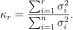</p>The singular values can be computed with, for example, `singular_values = scipy.linalg.svdvals(X)` where `X` is a snapshot matrix. If `plot=True`, plot the cumulative energy on a log scale.

**`pre.projection_error(X, Vr)`**: Compute the relative Frobenius-norm projection error on **X** induced by the basis matrix **V**<sub>_r_</sub>, <p align="center">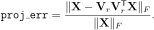</p>

<!-- TODO: allow norms other than Frobenius? -->

**`pre.minimal_projection_error(X, V, eps, plot=False)`**: Compute the number of POD basis vectors required to obtain a projection error less than `eps`, up to the number of columns of `V`. If `plot=True`, plot the projection error on a log scale as a function of the basis size.

<!-- TODO: allow norms other than Frobenius? -->

**`pre.reproject_continuous(f, Vr, X, U=None)`**: Sample re-projected trajectories [\[5\]](#references) of the continuous system of ODEs defined by `f`.

**`pre.reproject_discrete(f, Vr, x0, niters, U=None)`**: Sample re-projected trajectories [\[5\]](#references) of the discrete dynamical system defined by `f`.

**`pre.xdot_uniform(X, dt, order=2)`**: Approximate the first time derivative of a snapshot matrix `X` in which the snapshots are evenly spaced in time.

**`pre.xdot_nonuniform(X, t)`**: Approximate the first time derivative of a snapshot matrix `X` in which the snapshots are **not** evenly spaced in time.

**`pre.xdot(X, *args, **kwargs)`**: Call `pre.xdot_uniform()` or `pre.xdot_nonuniform()`, depending on the arguments.


## Postprocessing Tools

The `post` submodule is a collection of common routines for computing the absolute and relative errors produced by a ROM approximation.
Given a norm, "true" data **X**, and an approximation **Y** to **X**, these errors are defined by <p align="center">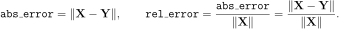</p>

**`post.frobenius_error(X, Y)`**: Compute the absolute and relative Frobenius-norm errors between snapshot sets `X` and `Y`, assuming `Y` is an approximation to `X`.
The [Frobenius matrix norm](https://en.wikipedia.org/wiki/Matrix_norm#Frobenius_norm) is defined by <p align="center">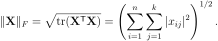</p>

**`post.lp_error(X, Y, p=2, normalize=False)`**: Compute the absolute and relative _l_<sup>_p_</sup>-norm errors between snapshot sets `X` and `Y`, assuming `Y` is an approximation to `X`.
The [_l_<sup>_p_</sup> norm](https://en.wikipedia.org/wiki/Lp_space#The_p-norm_in_finite_dimensions) is defined by <p align="center">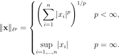</p>
With _p = 2_ this is the usual Euclidean norm.
The errors are calculated for each pair of columns of `X` and `Y`.
If `normalize=True`, then the _normalized absolute error_ is computed instead of the relative error: <p align="center">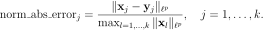</p>

**`post.Lp_error(X, Y, t=None, p=2)`**: Approximate the absolute and relative _L_<sup>_p_</sup>-norm errors between snapshot sets `X` and `Y` corresponding to times `t`, assuming `Y` is an approximation to `X`.
The [_L_<sup>_p_</sup> norm](https://en.wikipedia.org/wiki/Lp_space#Lp_spaces) for vector-valued functions is defined by <p align="center">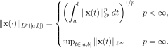</p>
For finite _p_, the integrals are approximated by the trapezoidal rule: <p align="center">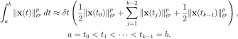</p>

The `t` argument can be omitted if _p_ is infinity (`p = np.inf`).


## Utility Functions

These functions are helper routines that are used internally for `fit()` or `predict()` methods.
See [DETAILS.md](DETAILS.md) for additional mathematical explanation.

**`utils.get_least_squares_size(modelform, r, m=0, affines=None)`**: Calculate the number of columns of the operator matrix **O** in the Operator Inference least squares problem (called _d(r,m)_ in [DETAILS.md](./DETAILS.md)).
Useful for determining the dimensions of the regularization matrix **𝚪** (see `utils.lstsq_reg()`).
- **Parameters**
    - `modelform`: the structure of the [desired model](#constructor).
    - `r`: The dimension of the reduced order model.
    - `m`: The dimension of the inputs of the model. Must be zero unless `'B'` is in `modelform`.
    - `affines`: A dictionary mapping labels of the operators that depend affinely on the parameter to the list of functions that define that affine dependence. The keys are entries of `modelform`. For example, if the constant term has the affine structure **c**(_**µ**_) = _θ_<sub>1</sub>(_**µ**_)**c**<sub>1</sub> + _θ_<sub>2</sub>(_**µ**_)**c**<sub>2</sub> + _θ_<sub>3</sub>(_**µ**_)**c**<sub>3</sub>, then `'c' -> [θ1, θ2, θ3]`.
- **Returns**
    - The number of columns of the unknown matrix in the Operator Inference least squares problem.

**`utils.lstsq_reg(A, b, P=0)`**: Solve the Tikhonov-regularized ordinary least-squares problem
<p align="center">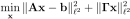</p>

  via [`scipy.linalg.lstsq()`](https://docs.scipy.org/doc/scipy/reference/generated/scipy.linalg.lstsq.html).
- **Parameters**
    - `A`: The data matrix. In the context of Operator Inference, this is the data matrix _D_ of projected snapshot data.
    - `b`: The right-hand side vector. If `b` is a matrix, solve the least squares problem for each column of `b`. In the context of Operator Inference, this is the right-hand side matrix **R** of projected time derivative data.
    - `P`: Tikhonov regularization factor. There are three options:
        - If `P` is a scalar, use the identity matrix times that scalar for the regularization matrix **𝚪**.
        - If `P` is a single matrix, use that matrix for **𝚪** in the problem described above.
        - If `P` is a list of scalars or matrices, use entry _j_ as the regularization factor for column _j_ of `b`.
- **Returns** (see [`scipy.linalg.lstsq()`](https://docs.scipy.org/doc/scipy/reference/generated/scipy.linalg.lstsq.html) for more details)
    - The least squares solution. In the context of Operator Inference, this is operator matrix **O**<sup>T</sup>.
    - The residual of the regularized least squares problem.
    - The effective rank of `A`.
    - The singular values of `A`.

Note that **𝚪** must match the size of the unknown vector **x**.
For Operator Inference, this means **𝚪** is _d_ x _d_ where the data matrix **D** is _k_ x _d_ and the unknown operator matrix **O**<sup>T</sup> is _d_ x _r_.
To calculate _d = d(r,m)_ for a specific model, use `utils.get_least_squares_size()`.

**`utils.kron2c(x)`**: Compute the compact, quadratic, column-wise (Khatri-Rao) Kronecker product of `x` with itself.

**`utils.kron3c(x)`**: Compute the compact, cubic, column-wise (Khatri-Rao) Kronecker product of `x` with itself three times.

**`utils.compress_H(H)`**: Convert the full _r_ x _r_<sup>2</sup> matricized quadratic operator `H` to the compact _r_ x (_r_(_r_+1)/2) matricized quadratic operator `Hc`.

**`utils.expand_Hc(Hc)`**: Convert the compact _r_ x (_r_(_r_+1)/2) matricized quadratic operator `Hc` to the full, symmetric, _r_ x _r_<sup>2</sup> matricized quadratic operator `H`.

**`utils.compress_G(G)`**: Convert the full _r_ x _r_<sup>3</sup> matricized cubic operator `G` to the compact _r_ x (_r_(_r_+1)(_r_+2)/6) matricized cubic operator `Gc`.

**`utils.expand_Gc(Gc)`**: Convert the compact _r_ x (_r_(_r_+1)(_r_+2)/6) matricized cubic operator `Gc` to the full, symmetric, _r_ x _r_<sup>3</sup> matricized cubic operator `G`.


## Index of Notation

We generally denote scalars in lower case, vectors in bold lower case, matrices in upper case, and indicate low-dimensional quantities with a hat.
In the code, a low-dimensional quantity ends with an underscore, so that the model classes follow some principles from the [scikit-learn](https://scikit-learn.org/stable/index.html) [API](https://scikit-learn.org/stable/developers/contributing.html#apis-of-scikit-learn-objects).

### Dimensions

| Symbol | Code | Description |
| :----: | :--- | :---------- |
| 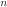 | `n`  | Dimension of the full-order system (large) |
| 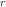 | `r`  | Dimension of the reduced-order system (small) |
| 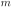 | `m`  | Dimension of the input **u** |
| 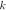 | `k`  | Number of state snapshots, i.e., the number of training points |
| 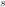 | `s`  | Number of parameter samples for parametric training |
| 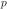 | `p` | Dimension of the parameter space |
| 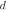 | `d` | Number of columns of the data matrix _D_ |

<!-- |  | `l` | Dimension of the output **y** | -->

<!-- ### Scalars

| Symbol | Code | Description |
| :----: | :--- | :---------- |
| 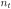 | `nt`  | Number of time steps in a simulation |
| | `µ` | Scalar parameter (_p_ = 1). | -->


### Vectors

| Symbol | Code | Size | Description |
| :----: | :--- | :--: | :---------- |
|  | `x` |  | Full-order state vector |
|  | `x_` |  | Reduced-order state vector |
|  | `xdot_` |  | Reduced-order state time derivative vector |
| 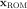 | `x_ROM` |  | Approximation to **x** produced by ROM |
|  | `c_` |  | Learned constant term  |
| 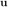 | `u` |  | Input vector  |
| 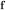 | `f(t,x,u(t))` or `f(x,u)` |   | Full-order system operator |
| 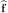 | `f_(t,x_,u(t))` or `f(x_,u)` |   | Reduced-order system operator |
| 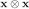 | `np.kron(x,x)` | 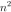 | Quadratic Kronecker product of full state |
| 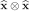 | `np.kron(x_,x_)` |   | Quadratic Kronecker product of reduced state |
| 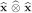 | `utils.kron2c(x_)` | 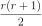  | Compact quadratic Kronecker product of reduced state |
|  | `np.kron(x,np.kron(x,x))` | 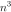 | Cubic Kronecker product of full state |
| 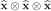 | `np.kron(x_,np.kron(x_,x_))` | 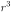  | Cubic Kronecker product of reduced state |
| 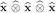 | `utils.kron3c(x_)` |   | Compact cubic Kronecker product of reduced state |
|  | `vj` |  | _j_<sup>th</sup> subspace basis vector, i.e., column _j_ of **V**<sub>_r_</sub> |

<!-- | **y**  | `y`             | Output vector | -->
<!-- | **y_ROM**, **y~** | `y_ROM`      | Approximation to **y** produced by ROM | -->

### Matrices

| Symbol | Code | Shape | Description |
| :----: | :--- | :---: | :---------- |
|  | `Vr` |  | low-rank basis of rank _r_ (usually the POD basis) |
|  | `X` |  | Snapshot matrix |
|  | `Xdot` |  | Snapshot time derivative matrix |
|  | `U` |  | Input matrix (inputs corresonding to the snapshots) |
|  | `X_` |  | Projected snapshot matrix |
|  | `Xdot_` |  | Projected snapshot time derivative matrix |
|  | `D` |  | Data matrix |
|  | `O` |  | Operator matrix |
|  | `R` |  | Right-hand side matrix |
|  | `P` |  | Tikhonov regularization matrix |
|  | `A` |  | Full-order linear state matrix |
|  | `A_` |  | Reduced-order linear state matrix |
|  | `H` |  | Full-order matricized quadratic state tensor |
|  | `H_` |  | Reduced-order matricized quadratic state tensor |
|  | `Hc_` |  | Compact reduced-order matricized quadratic state tensor |
|  | `G` |  | Full-order matricized quadratic state tensor |
|  | `G_` |  | Reduced-order matricized quadratic state tensor |
|  | `Gc_` |  | Compact reduced-order matricized quadratic state tensor |
|  | `B` |  | Full-order input matrix |
|  | `B_` |  | Reduced-order input matrix |

<!-- |  | `C` |  | Full-order output matrix | -->
<!-- |  | `C_` |  | Reduced-order output matrix | -->
<!-- |  | `Ni_` |  | Bilinear state-input matrix for _i_th input | -->


## References

- \[1\] [Peherstorfer, B.](https://scholar.google.com/citations?user=C81WhlkAAAAJ) and [Willcox, K.](https://kiwi.oden.utexas.edu/),
[Data-driven operator inference for non-intrusive projection-based model reduction.](https://www.sciencedirect.com/science/article/pii/S0045782516301104)
_Computer Methods in Applied Mechanics and Engineering_, Vol. 306, pp. 196-215, 2016.
([Download](https://kiwi.oden.utexas.edu/papers/Non-intrusive-model-reduction-Peherstorfer-Willcox.pdf))<details><summary>BibTeX</summary><pre>
@article{PW2016OperatorInference,
    title     = {Data-driven operator inference for nonintrusive projection-based model reduction},
    author    = {Peherstorfer, B. and Willcox, K.},
    journal   = {Computer Methods in Applied Mechanics and Engineering},
    volume    = {306},
    pages     = {196--215},
    year      = {2016},
    publisher = {Elsevier}
}</pre></details>

- \[2\] [Qian, E.](https://scholar.google.com/citations?user=jnHI7wQAAAAJ), [Kramer, B.](http://kramer.ucsd.edu/), [Marques, A.](https://scholar.google.com/citations?user=d4tBWWwAAAAJ), and [Willcox, K.](https://kiwi.oden.utexas.edu/),
[Transform & Learn: A data-driven approach to nonlinear model reduction](https://arc.aiaa.org/doi/10.2514/6.2019-3707).
In the AIAA Aviation 2019 Forum & Exhibition, Dallas, TX, June 2019. ([Download](https://kiwi.oden.utexas.edu/papers/learn-data-driven-nonlinear-reduced-model-Qian-Willcox.pdf))<details><summary>BibTeX</summary><pre>
@inbook{QKMW2019TransformAndLearn,
    title     = {Transform \\& Learn: A data-driven approach to nonlinear model reduction},
    author    = {Qian, E. and Kramer, B. and Marques, A. N. and Willcox, K. E.},
    booktitle = {AIAA Aviation 2019 Forum},
    doi       = {10.2514/6.2019-3707},
    URL       = {https://arc.aiaa.org/doi/abs/10.2514/6.2019-3707},
    eprint    = {https://arc.aiaa.org/doi/pdf/10.2514/6.2019-3707}
}</pre></details>

- \[3\] [Swischuk, R.](https://scholar.google.com/citations?user=L9D0LBsAAAAJ), [Mainini, L.](https://scholar.google.com/citations?user=1mo8GgkAAAAJ), [Peherstorfer, B.](https://scholar.google.com/citations?user=C81WhlkAAAAJ), and [Willcox, K.](https://kiwi.oden.utexas.edu/),
[Projection-based model reduction: Formulations for physics-based machine learning.](https://www.sciencedirect.com/science/article/pii/S0045793018304250)
_Computers & Fluids_, Vol. 179, pp. 704-717, 2019.
([Download](https://kiwi.oden.utexas.edu/papers/Physics-based-machine-learning-swischuk-willcox.pdf))<details><summary>BibTeX</summary><pre>
@article{SMPW2019PhysicsbasedML,
    title     = {Projection-based model reduction: Formulations for physics-based machine learning},
    author    = {Swischuk, R. and Mainini, L. and Peherstorfer, B. and Willcox, K.},
    journal   = {Computers \\& Fluids},
    volume    = {179},
    pages     = {704--717},
    year      = {2019},
    publisher = {Elsevier}
}</pre></details>

- \[4\] [Swischuk, R.](https://scholar.google.com/citations?user=L9D0LBsAAAAJ), [Physics-based machine learning and data-driven reduced-order modeling](https://dspace.mit.edu/handle/1721.1/122682). Master's thesis, Massachusetts Institute of Technology, 2019. ([Download](https://dspace.mit.edu/bitstream/handle/1721.1/122682/1123218324-MIT.pdf))<details><summary>BibTeX</summary><pre>
@phdthesis{swischuk2019MLandDDROM,
    title  = {Physics-based machine learning and data-driven reduced-order modeling},
    author = {Swischuk, Renee},
    year   = {2019},
    school = {Massachusetts Institute of Technology}
}</pre></details>

- \[5\] [Peherstorfer, B.](https://scholar.google.com/citations?user=C81WhlkAAAAJ) [Sampling low-dimensional Markovian dynamics for pre-asymptotically recovering reduced models from data with operator inference](https://arxiv.org/abs/1908.11233). arXiv:1908.11233.
([Download](https://arxiv.org/pdf/1908.11233.pdf))<details><summary>BibTeX</summary><pre>
@article{peherstorfer2019samplingMarkovian,
    title   = {Sampling low-dimensional Markovian dynamics for pre-asymptotically recovering reduced models from data with operator inference},
    author  = {Peherstorfer, Benjamin},
    journal = {arXiv preprint arXiv:1908.11233},
    year    = {2019}
}</pre></details>

- \[6\] [Swischuk, R.](https://scholar.google.com/citations?user=L9D0LBsAAAAJ), [Kramer, B.](http://kramer.ucsd.edu/), [Huang, C.](https://scholar.google.com/citations?user=lUXijaQAAAAJ), and [Willcox, K.](https://kiwi.oden.utexas.edu/), [Learning physics-based reduced-order models for a single-injector combustion process](https://arc.aiaa.org/doi/10.2514/1.J058943). _AIAA Journal_, Vol. 58:6, pp. 2658-2672, 2020. Also in Proceedings of 2020 AIAA SciTech Forum & Exhibition, Orlando FL, January, 2020. Also Oden Institute Report 19-13.
([Download](https://kiwi.oden.utexas.edu/papers/learning-reduced-model-combustion-Swischuk-Kramer-Huang-Willcox.pdf))<details><summary>BibTeX</summary><pre>
@article{SKHW2020ROMCombustion,
    title     = {Learning physics-based reduced-order models for a single-injector combustion process},
    author    = {Swischuk, R. and Kramer, B. and Huang, C. and Willcox, K.},
    journal   = {AIAA Journal},
    volume    = {58},
    number    = {6},
    pages     = {2658--2672},
    year      = {2020},
    publisher = {American Institute of Aeronautics and Astronautics}
}</pre></details>

- \[7\] [Qian, E.](https://scholar.google.com/citations?user=jnHI7wQAAAAJ), [Kramer, B.](http://kramer.ucsd.edu/), [Peherstorfer, B.](https://scholar.google.com/citations?user=C81WhlkAAAAJ), and [Willcox, K.](https://kiwi.oden.utexas.edu/) [Lift & Learn: Physics-informed machine learning for large-scale nonlinear dynamical systems](https://www.sciencedirect.com/science/article/abs/pii/S0167278919307651). _Physica D: Nonlinear Phenomena_, Vol. 406, May 2020, 132401. ([Download](https://kiwi.oden.utexas.edu/papers/lift-learn-scientific-machine-learning-Qian-Willcox.pdf))<details><summary>BibTeX</summary><pre>
@article{QKPW2020LiftAndLearn,
    title   = {Lift \\& Learn: Physics-informed machine learning for large-scale nonlinear dynamical systems.},
    author  = {Qian, E. and Kramer, B. and Peherstorfer, B. and Willcox, K.},
    journal = {Physica {D}: {N}onlinear {P}henomena},
    volume  = {406},
    pages   = {132401},
    url     = {https://doi.org/10.1016/j.physd.2020.132401},
    year    = {2020}
}</pre></details>

- \[8\] [Benner, P.](https://scholar.google.com/citations?user=6zcRrC4AAAAJ), [Goyal, P.](https://scholar.google.com/citations?user=9rEfaRwAAAAJ), [Kramer, B.](http://kramer.ucsd.edu/), [Peherstorfer, B.](https://scholar.google.com/citations?user=C81WhlkAAAAJ), and [Willcox, K.](https://kiwi.oden.utexas.edu/) [Operator inference for non-intrusive model reduction of systems with non-polynomial nonlinear terms](https://arxiv.org/abs/2002.09726). arXiv:2002.09726. Also Oden Institute Report 20-04. ([Download](https://kiwi.oden.utexas.edu/papers/Non-intrusive-nonlinear-model-reduction-Benner-Goyal-Kramer-Peherstorfer-Willcox.pdf))<details><summary>BibTeX</summary><pre>
@article{BGKPW2020OpInfNonPoly,
    title   = {Operator inference for non-intrusive model reduction of systems with non-polynomial nonlinear terms},
    author  = {Benner, P. and Goyal, P. and Kramer, B. and Peherstorfer, B. and Willcox, K.},
    journal = {arXiv preprint arXiv:2002.09726},
    year    = {2020}
}</pre></details>
